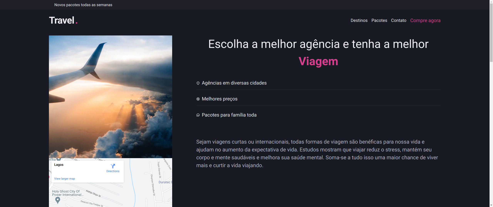

# Travel



> Travel é um site de viagens pelo mundo, toda aplicação foi construída com React.js, chakra ui e typescript. O objetivo é treinar os conhecimentos adquiridos no treinamento do Ignite da Rocketseat.

## 💻 Pré-requisitos

Antes de começar, verifique se você atendeu aos seguintes requisitos:

- Você instalou a versão mais recente do `< node / npm ou yarn >`
- Você tem uma máquina `<Windows / Linux / Mac >`.

## 🚀 Instalando o projeto na sua maquina

Para instalar o projeto, siga estas etapas:

Linux e macOS:

```bash
git clone https://github.com/alextfonseca/Travel.git
$ cd travel
$ yarn install ou npm install
$ yarn start ou npm start
```

Windows:

```bash
git clone https://github.com/alextfonseca/Travel.git
$ cd travel
$ yarn install ou npm install
$ yarn start ou npm start
```

## 🧾 Usando o projeto

Com o projeto Travel você pode terá um exemplo de como construir aplicações do futuro, usando interface declarativa no React.js:

# <a href="https://travel-zeta.vercel.app">Acesse o projeto</a>

## 😄 Me siga nas redes sociais<br>

<p align="left">

  <a href="https://www.linkedin.com/in/alex-teixeira-da-fonseca-5a99931a2/" alt="Linkedin">
  </a>

  <a href="https://wa.me/+5511976184659?text=Olá%20Alex" alt="WhatsApp">
  </a>

  <a href="https://www.instagram.com/devalextf/?hl=pt-br" alt="Instagram">
  </a>
</p>
